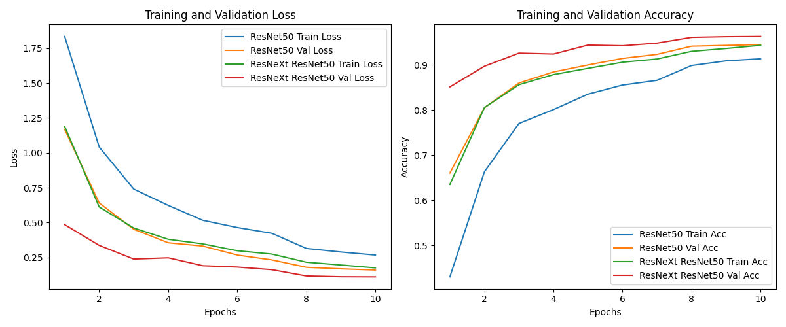
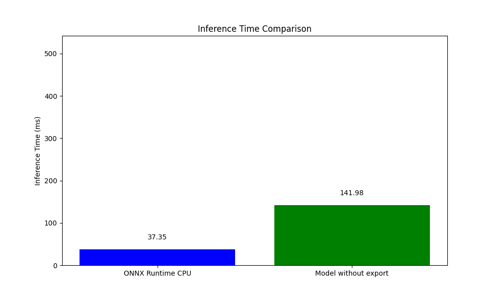

# Image-Classification-on-modified-ResNet
A custom image classification model based on ResNet architecture, enhanced with self created ResNeXt bottleneck module from improved performance

## Features
- Custom ResNeXt bottleneck for improved classification performance.
- Performance Comparision
- Model export capabilities to TorchScript and ONNX.

## Performance Comparison
The modified ResNet with new Bottleneck module outperformed ResNet

## Inference Time Comparison
ONNX inference time is significantly faster

